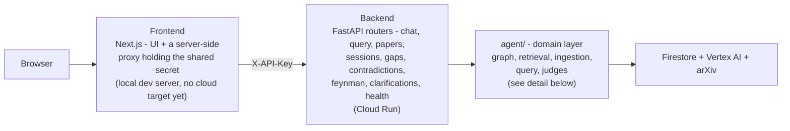
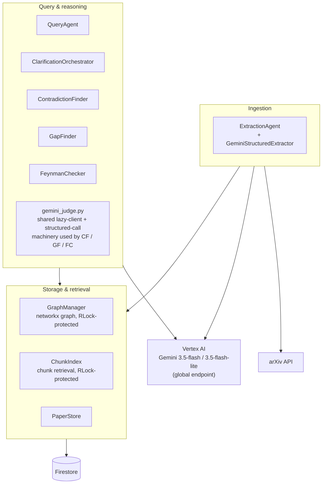
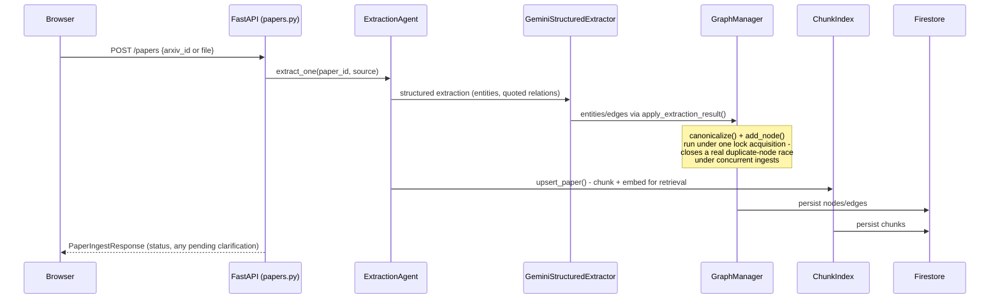
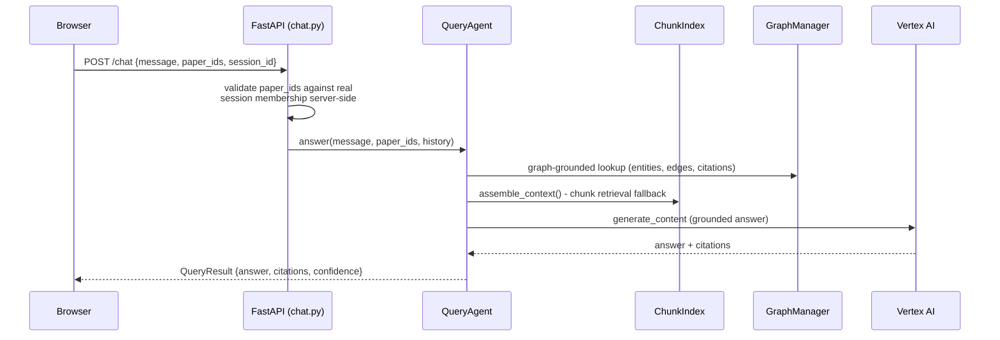

# Architecture

Atlas is a FastAPI backend (`service/` + `agent/`) and a Next.js frontend
(`frontend/`), talking to Firestore and Vertex AI (Gemini). The backend
deploys to Cloud Run as a single container (see [`service/DEPLOY.md`](service/DEPLOY.md));
the frontend currently runs as a local Next.js dev server (`npm run dev`) -
no cloud deployment target is configured for it yet.

## Layers

## Agent layer detail

Every request from a Backend router lands in one of these three groups
- ingest a paper, ask a question, or check/quiz against the graph - and
every group ultimately reads or writes through `GraphManager`/`ChunkIndex`/
`PaperStore`, the three classes carrying the concurrency locks described
below.

## Two core request flows

**Ingesting a paper** - `POST /papers` (arXiv id or PDF upload):

**Asking a question, with contradiction/gap awareness** - `POST /chat`:

## Why the locks

`GraphManager`, `ChunkIndex`, and `PaperStore` are each shared, mutable,
in-process state accessed by FastAPI's concurrently-run sync route
handlers - a chat request reading `ChunkIndex` while a paper ingest
writes to it, or two ingests racing to create the same new graph node.
Each carries its own lock scoped tightly to the state it protects, never
held across slow work (a Gemini call, a Firestore network round trip) -
see the classes themselves for the specific race each lock closes and
the regression test that proves it.

## Deployment

- **Backend**: single container, Cloud Run, `--min-instances=1
  --max-instances=1` (required, not tuned - see `service/DEPLOY.md` for
  why more than one instance would let sessions diverge). Auth is a
  shared-secret `X-API-Key` header, not full user auth - a cost gate on
  an otherwise-public URL.
- **Frontend**: local Next.js dev server only, as of this diagram. Its
  `app/api/*` routes are a real security boundary even locally - they're
  the only place `API_SHARED_SECRET` ever exists outside the backend
  itself, so the browser never sees it.
- **Data**: Firestore (project `all-things-agentic-hack`), same project
  Vertex AI calls resolve against via Application Default Credentials.
