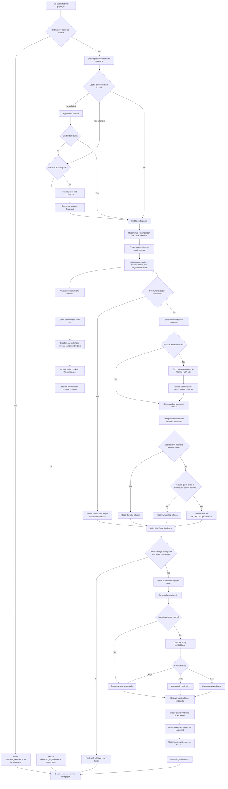

# Document Ingestion Flow

This document describes the complete ingestion path for one PDF, including
local parsing, optional OCR, retrieval indexing, Vertex AI extraction, graph
canonicalization, persistence, retries, and failure isolation.

### In baby steps

1. The caller supplies one PDF path and a stable `paper_id`.
2. The extractor validates the path when an allowed upload/corpus root is
   configured.
3. PyMuPDF reads positioned text blocks and reconstructs multi-column reading
   order. `pdftotext` is the parser fallback.
4. If the PDF contains too little usable text, the optional local OCR path
   renders its pages and runs Tesseract. OCR-derived pages are tagged `ocr`.
5. The text is separated into pages and sections, then divided into ordered
   chunks. Every chunk retains citation and adjacency metadata.
6. Every chunk enters the retrieval index. Stable IDs make retries safe, and
   reprocessing replaces obsolete chunks instead of leaving stale results.
7. Without a semantic extractor, ingestion stops here with retrieval-ready
   chunks and no graph facts. This path makes no model API call.
8. With `GeminiStructuredExtractor`, bounded source windows are sent to Vertex
   AI. The response must match the fixed entity and relation enums.
9. Relations with impossible endpoint-type combinations are discarded. Every
   remaining relation must contain a quote found in its source window after
   whitespace and PDF-hyphenation normalization.
10. The Graph Manager canonicalizes entities by normalized name first and
    embedding similarity second. High-confidence matches merge, low-confidence
    matches become new nodes, and middle-band matches require clarification.
11. Stable nodes and evidence-backed edges are written to NetworkX and,
    optionally, Firestore. Repeating the same write does not create duplicates.
12. A failure is attached only to the affected paper, so batch processing can
    continue with subsequent PDFs.
